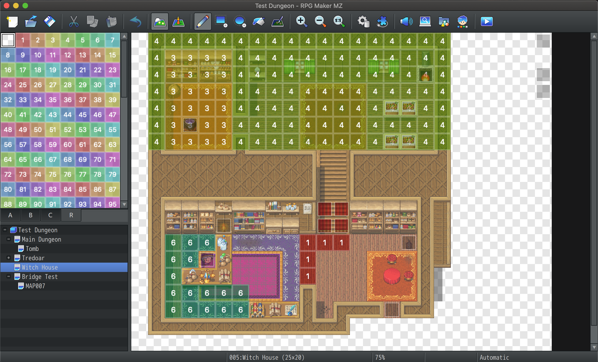
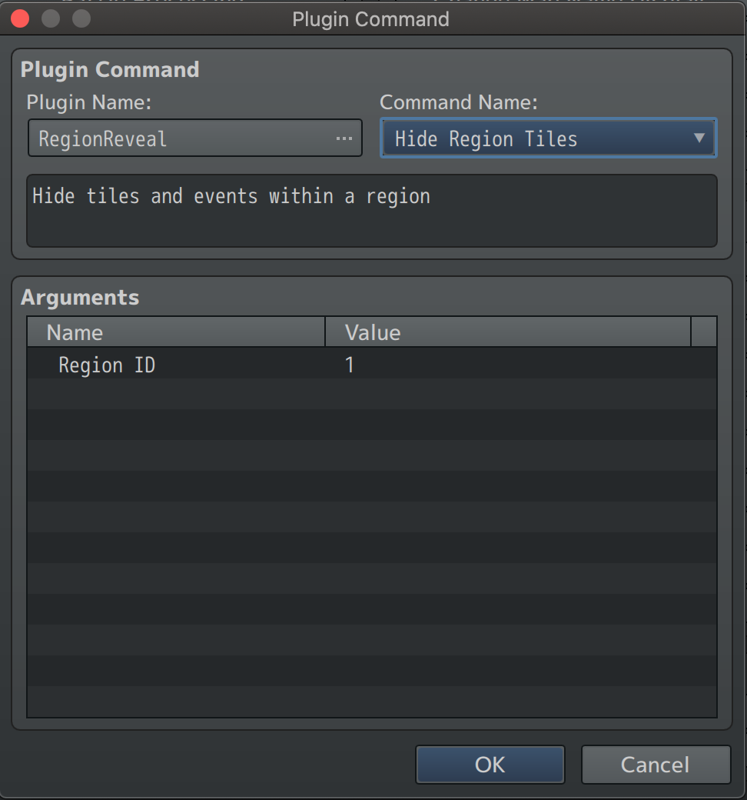

# RegionReveal
RegionReveal is a RPGMaker MZ Plugin, that hides and shows tiles and events on the map depending on region.

## Installation
To install this plugin, navigate to your game js directory and add drop just the `regionreveal.js` file in the plugins folder.

Within RPGMaker MZ, go to Plugin Manager click edit and add the plugin.

## Usage
RegionReveal uses RPGMaker built in plugin commands.

Add regions via the region tileset.

To trigger the show/hide region add content to an event, click tab 3 and select plugin command.

From the plugin command select "RegionReveal" from the Command Name select either show or hide

- Show, reveals a hidden region.
- Hide, hides the region.

The variable Region ID, is the ID of the region you are hiding or revealing.

**Note: When a region is hidden, this includes all layer and events**

## License
This plugin is distributed under MIT License, this means you are free to use it in your games both commercial and non-commercial. I would ask that if you use it in your game you include credit to `Amateur Game Dev - https://amateurgame.dev`
